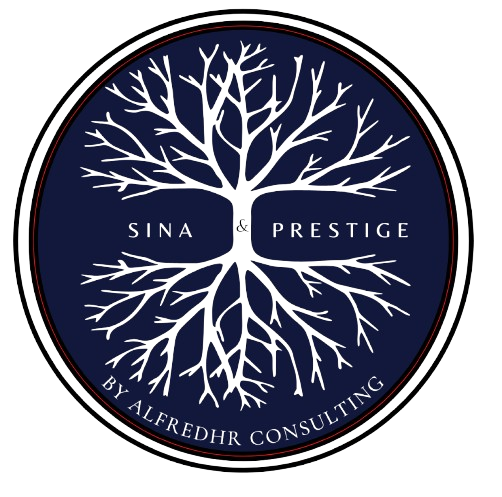
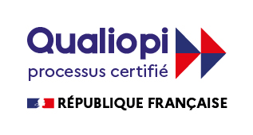

<!DOCTYPE html>
<html lang="fr">
<head>
    <meta charset="UTF-8">
    <meta name="viewport" content="width=device-width, initial-scale=1.0">
    <link rel="preconnect" href="https://fonts.googleapis.com">
    <link rel="preconnect" href="https://fonts.gstatic.com" crossorigin>
    <link rel="stylesheet" href="css/styles.css?v=1.0">
    <title>Webinaires & Masterclass - Sina & Prestige</title>
    <meta name="description" content="Webinaires et masterclass en ligne pour monter en compétences avec nos experts en RH, IA et management.">
    <link rel="canonical" href="https://sinaetprestige.fr/webinaires-masterclass">
    <meta property="og:title" content="Webinaires & Masterclass - Sina & Prestige">
    <meta property="og:description" content="Rendez-vous en ligne avec nos experts - Montez en compétences et repartez avec des méthodes applicables.">
    <meta property="og:url" content="https://sinaetprestige.fr/webinaires-masterclass">
    <meta property="og:type" content="website">
    <meta property="og:image" content="https://sinaetprestige.fr/images/og-image.png">
    
</head>
<body style="background: linear-gradient(135deg, #f0f5fa 0%, #e8f1f8 100%);">
    <!-- STICKY TOP BAR -->
    

        

            
<strong>Sina & Prestige</strong> - Organisme de formation certifié Qualiopi

            
Catalogue • Webinaires • Recrutement • Accompagnement RH • Qualité & accessibilité

        

        <a href="contact" class="top-bar-cta" aria-label="Demander un devis">Demander un devis</a>
        <button class="top-bar-close" onclick="document.getElementById('topBar').classList.add('hidden'); document.body.classList.remove('has-top-bar');" aria-label="Fermer la barre d'information">✕</button>
    

    <!-- HEADER -->
    <header role="navigation" aria-label="Navigation principale">
        <nav aria-label="Menu principal">
            <a href="index" class="logo-section" aria-label="Retour À l'accueil">
                
                

                    
SINA & PRESTIGE

                    
ALFREDHRCONSULTING

                

            </a>
            <ul role="menubar">
                <li role="none"><a href="index" role="menuitem">Accueil</a></li>
                <li role="none"><a href="recrutement" role="menuitem">Recrutement</a></li>
                <li role="none"><a href="webinaires-masterclass" role="menuitem">Webinaires & Masterclass</a></li>
                <li role="none"><a href="accompagnement-rh" role="menuitem">Accompagnement RH</a></li>
                <li role="none"><a href="formations" role="menuitem">Formations</a></li>
                <li role="none"><a href="entreprise" role="menuitem">Entreprise & Partenaires</a></li>
                <li role="none"><a href="qualite" role="menuitem">Qualité & accessibilité</a></li>
                <li role="none"><a href="a-propos" role="menuitem">À propos</a></li>
                <li role="none"><a href="contact" role="menuitem">Contact</a></li>
            </ul>
        </nav>
    </header>

    <main id="main-content">
        <!-- HERO -->
        <section class="hero" style="position: relative; z-index: 2;">
            

                <h1>Webinaires & Masterclass</h1>
                
Des rendez-vous en ligne ou en présentiel pour monter en compétences, rencontrer des experts et repartir avec des méthodes immédiatement applicables.

                <a href="contact" class="hero-btn">S'inscrire À un webinaire</a>
                <a href="contact" class="hero-btn2">Demander un devis</a>
            

            

                

                
            

        </section>

        <section class="events-container">
            

                

                    <h3>RH & Intelligence artificielle</h3>
                

                

                    
<strong>Enjeux, opportunités et bonnes pratiques de l'IA pour la fonction RH et la gestion des talents.</strong>

                    

                        
<strong>Date :</strong> Jeudi 24 septembre 2026

                        
<strong>Horaire :</strong> 14h00 - 15h30

                        
<strong>Format :</strong> En ligne et présentiel

                        
<strong>Public :</strong> Responsables RH, Managers, Directeurs

                        
<strong>Intervenant :</strong> Expert RH et transformation digitale

                        
<strong>Tarif :</strong> À communiquer

                        
<strong>Programme :</strong> Cas d'usage IA en RH, risques et éthique, mise en pratique immédiate

                        
<strong>Replay :</strong> Disponible 7 jours après l'événement

                    

                    

                        <a href="contact?event=rh-ia">Je m'inscris À l'événement</a>
                        <a href="contact?type=newsletter-webinaire" style="background: white; color: #2c4f73; border: 2px solid #2c4f73;">Je souhaite être informé(e) des prochains rendez-vous</a>
                    

                

            

        </section>

        <section class="content-card">
            <h2>Organiser une masterclass pour mon entreprise ?</h2>
            
Nous organisons des webinaires et masterclass personnalisés adaptés aux enjeux spécifiques de votre organisation.

            
<strong>Thématiques possibles :</strong> Management, IA et transformation, RH et conformité, Employabilité, Leadership, Qualité et accessibilité, etc.

            

                <a href="contact?type=custom-masterclass" class="cta-btn">Nous contacter</a>
            

        </section>

        <section class="cta-section">
            <h2>Vous avez des questions ?</h2>
            
Consultez notre page Ressources pour plus d'informations ou contactez-nous directement.

            

                <a href="ressources" class="cta-btn cta-btn-secondary">Ressources</a>
                <a href="contact" class="cta-btn">Contact</a>
            

        </section>
    </main>

    <!-- FOOTER - STANDARD -->
    <footer role="contentinfo" aria-label="Pied de page">
        

            <!-- LEFT COLUMN -->
            

                <section class="footer-section">
                    <h4>Sina & Prestige</h4>
                    
Organisme de formation déclaré

                    
<strong>NDA :</strong> 11 75 73 30 575

                    
<strong>Région :</strong> Île-de-France

                    
<strong>Email :</strong> contact@sinaetprestige.fr

                </section>
            

            <!-- RIGHT COLUMN - 3 GRIDS -->
            

                <!-- SERVICES -->
                <section class="footer-section">
                    <h4>Nos Services</h4>
                    <ul>
                        <li><a href="formations">Formations</a></li>
                        <li><a href="webinaires-masterclass">Webinaires & Masterclass</a></li>
                        <li><a href="recrutement">Recrutement</a></li>
                        <li><a href="accompagnement-rh">Accompagnement RH</a></li>
                        <li><a href="entreprise">Partenaires</a></li>
                    </ul>
                </section>

                <!-- INFORMATIONS -->
                <section class="footer-section">
                    <h4>Informations</h4>
                    <ul>
                        <li><a href="a-propos">À propos</a></li>
                        <li><a href="contact">Contact</a></li>
                        <li><a href="reclamations">Réclamations</a></li>
                        <li><a href="accessibilite">Accessibilité</a></li>
                        <li><a href="ressources">Documents</a></li>
                    </ul>
                </section>

                <!-- LEGAL -->
                <section class="footer-section">
                    <h4>Documents Légaux</h4>
                    <ul>
                        <li><a href="mentions-legales">Mentions légales</a></li>
                        <li><a href="confidentialite">Confidentialité</a></li>
                        <li><a href="cgv">CGV / CGU</a></li>
                    </ul>
                </section>
            

        

        <!-- BOTTOM SECTION -->
        

            

                

                    
                    

                        <h5>Qualiopi</h5>
                        
Certification Qualiopi

                        <a href="https://travail-emploi.gouv.fr/qualiopi-marque-de-certification-qualite-des-prestataires-de-formation" target="_blank" class="qualiopi-link">En savoir plus →</a>
                    

                

            

            

                
&copy; 2026 SINA & PRESTIGE - Tous droits réservés

            

            

                

            

        

    </footer>

    
</body>
</html>
